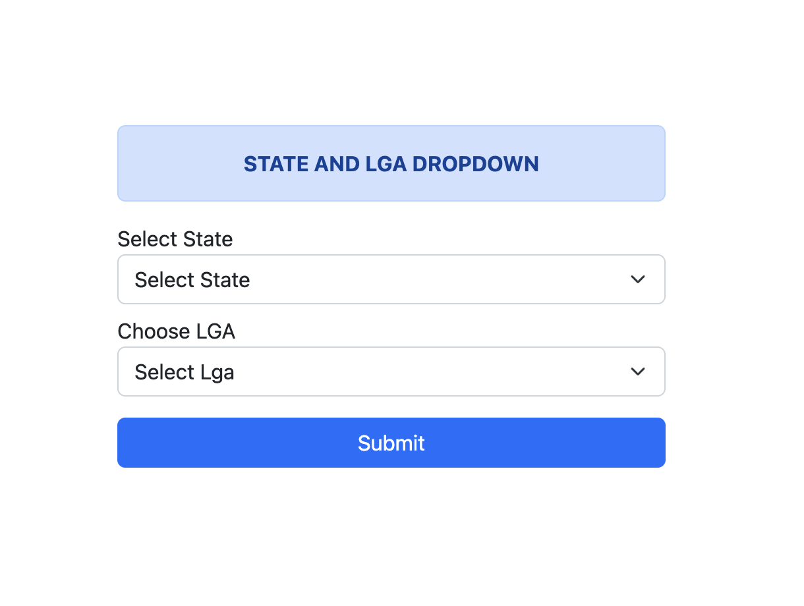

## STATES IN NIGERIA AND THEIR LGAS

## About

This library makes it easy to integrate states in nigeria and lgas to your form.

## Steps for Integration

Copy this cdn link and paste it before the close of the body in your html file where the form is placed

``

Create a select form tag and give it an id of state.

Create another select form tag and give it an id of of lga.

Every other things will be handled for you out of the box.

<b>If your find this useful please make sure to give it a star</b>

<b>Thanks.</b>

